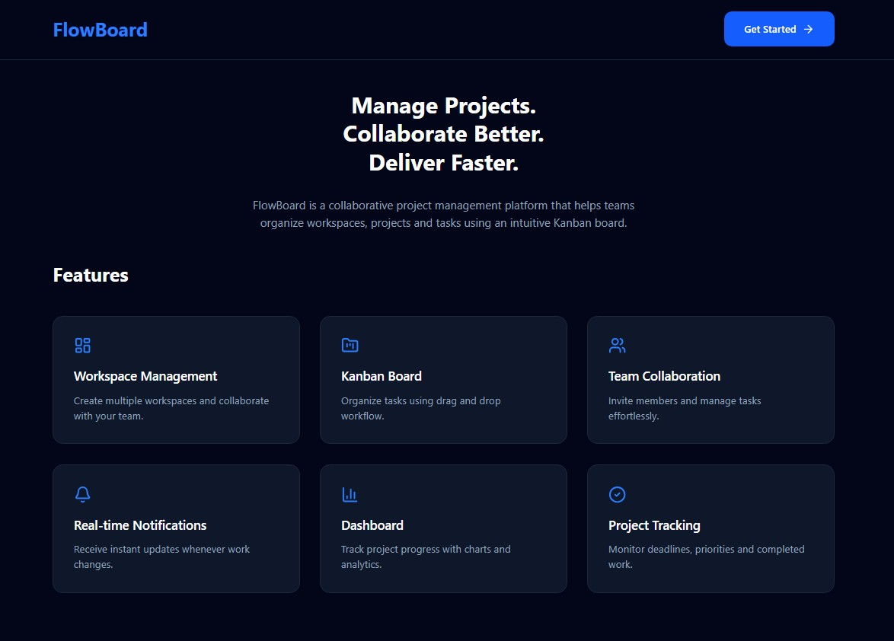
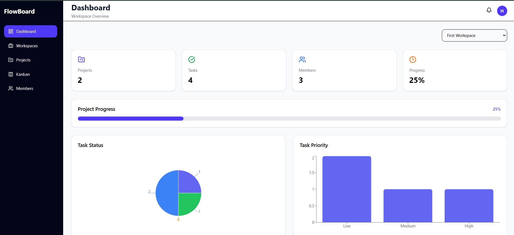
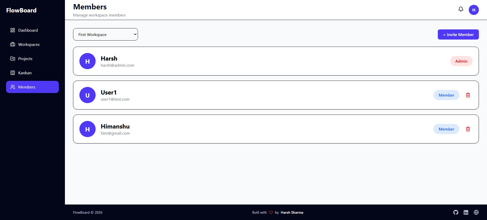
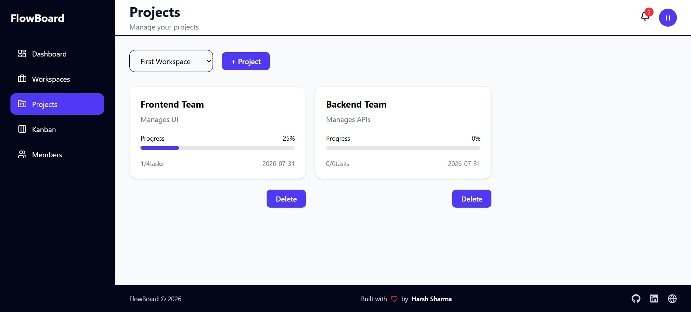
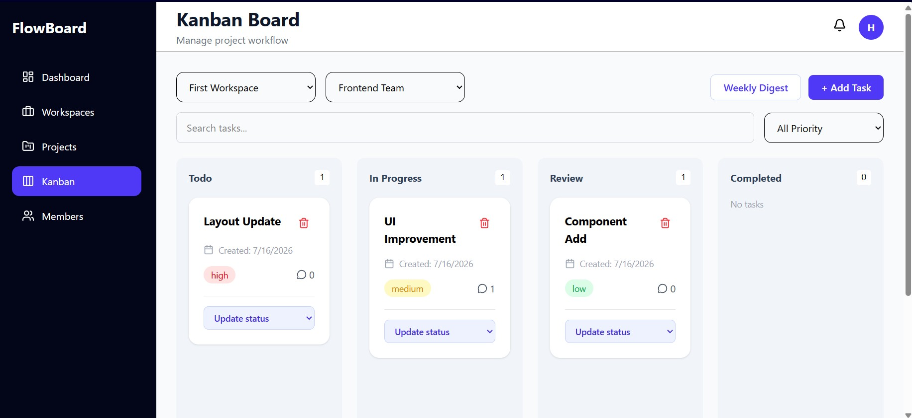

# 🚀 FlowBoard - Project Management SaaS

FlowBoard is a full-stack **Project Management SaaS** platform built with the **MERN Stack**, **Redis**, and **Socket.IO**.  
It helps teams manage workspaces, projects, tasks, members, and real-time collaboration using a Kanban workflow, with safe concurrent editing, activity tracking, overdue alerts, and an AI-powered weekly project digest.

---

## 🌐 Live Demo

- **Frontend:** https://flowboard-workspace.vercel.app
- **Backend API:** https://flowboard-api-eutr.onrender.com

---

## 📸 Screenshots

### Home


### Application
<table>
  <tr>
    <td></td>
    <td></td>
  </tr>
  <tr>
    <td></td>
    <td></td>
  </tr>
</table>

---

## ✨ Features

- 🔐 JWT Authentication & Protected Routes
- 🏢 Multi-Workspace Management
- 👥 Team Collaboration & Role-Based Access
- 📁 Project Management
- 📌 Kanban Board with One-Click Status Updates
- ✏️ Task Editing with Conflict Detection (Optimistic Concurrency)
- 🧾 Per-Task Activity Log
- ⏰ Overdue Task Alerts via Background Job
- 🤖 AI Weekly Digest for Projects
- 🔔 Real-Time Notifications
- 📊 Dashboard Analytics
- ⚙️ Profile & Password Management

---

## 🛠️ Tech Stack

**Frontend:** React, TypeScript, Vite, Redux Toolkit, Tailwind CSS, React Router, Axios, Recharts, Socket.IO Client

**Backend:** Node.js, Express.js, TypeScript, MongoDB, Mongoose, Redis, BullMQ, JWT, Bcrypt, Socket.IO

**AI:** Vercel AI SDK with Groq

---

## 🚀 Getting Started

```bash
# Clone the repository
git clone https://github.com/harsh0190/FlowBoard.git

# Install dependencies
cd client && npm install
cd ../server && npm install

# Start development servers
npm run dev
```

---

## 🤝 Contributing

Contributions are welcome! Feel free to open an issue or submit a Pull Request.

If you found this project helpful, consider giving it a ⭐ on GitHub.
